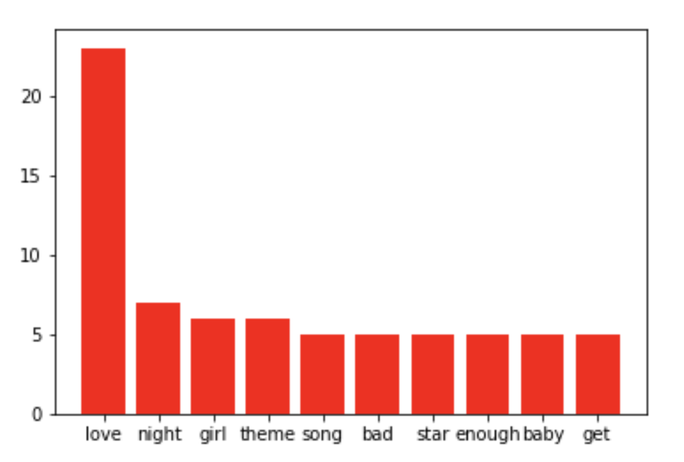
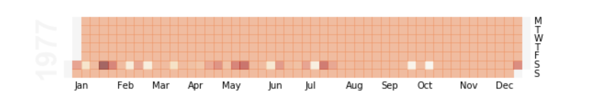

# Text-Analysis-and-Data-Visualization
Material for Python courses on Text Analysis and Data Visualization.

## What are the words used the most in the 70's hits? 
<dd> &#127925  &#127925  &#127925 </dd> 

## On which day did hit songs reach number one in 1977? 

## Where are radios located in the state of Sao Paulo?

In this course we are going to learn how to program with Python, perform data/text analysis and visualization.
